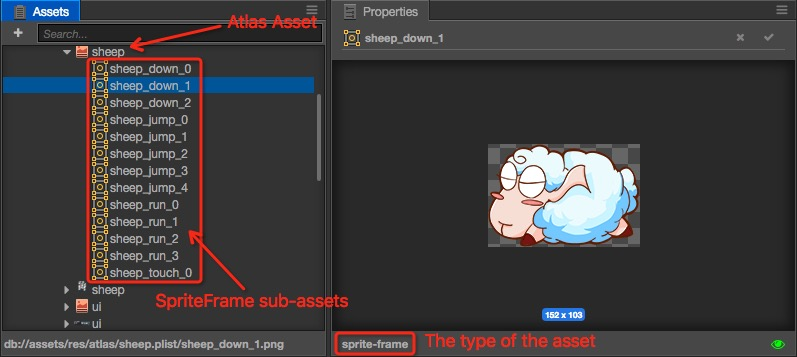

# Atlas

Atlas also named Sprite Sheet, it's a common asset in game developing. Atlas is generated by tools. The tools will combine many images into a large image and create an index file (such as **plist**). Altas asset contains **plist** & **png** is supported by Cocos Creator. Here is a image of an Atlas asset:

## Why using Atlas

Advantages of Atlas:

- In the combin process, blank spaces of images will be removed. And many optimization algorithm will be used. So this will reduce the size & memory of the game.
- When many Sprites using SpriteFrame from one Atlas asset, they can be rendered in one render command. This will reduce CPU consumption.

Here is a video from CodeAndWeb, it will show you [What is a Sprite Sheet](https://www.codeandweb.com/what-is-a-sprite-sheet)。

## Create Atlas Asset

You should prepare the original images for generating Atlas:

Then you can generate Atlas by special tools. We suggest:

- [TexturePacker](https://www.codeandweb.com/texturepacker)
- [Zwoptex](https://zwopple.com/zwoptex/)

Please select plist files for cocos2d-x when export atlas by the tool. Then you will get **plist** & **png** with the same name:

## Import Atlas

Drag **plist** & **png** files into **Assets Panel** at the same time. Then you can use it in Cocos Creator.

### Atlas & SpriteFrame

In the [Texture Document](sprite.md), we introduced the relationship between Texture & SpriteFrame. When Atlas asset imported, here is also a triangle icon beside the `Atlas` asset. Click it to expand Atlas asset. There will be many `SpriteFrame` sub-assets, each one can be used separately.

Continue on to read about [Trim](trim.md).