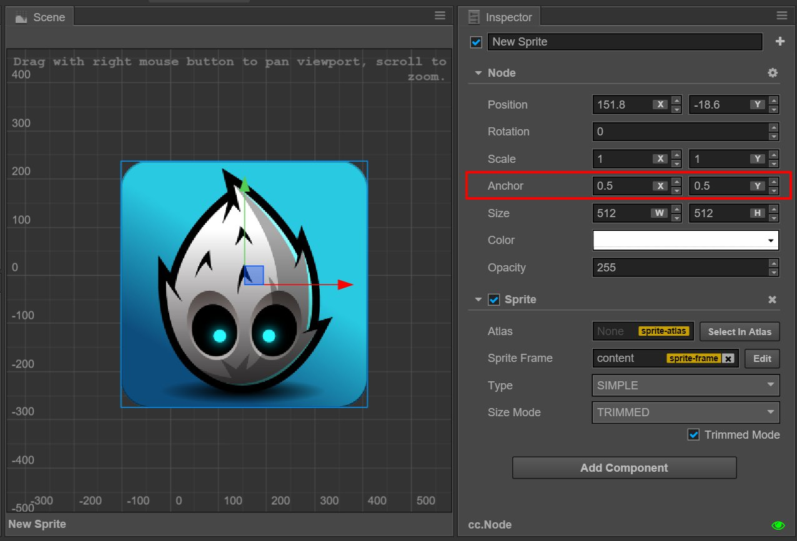
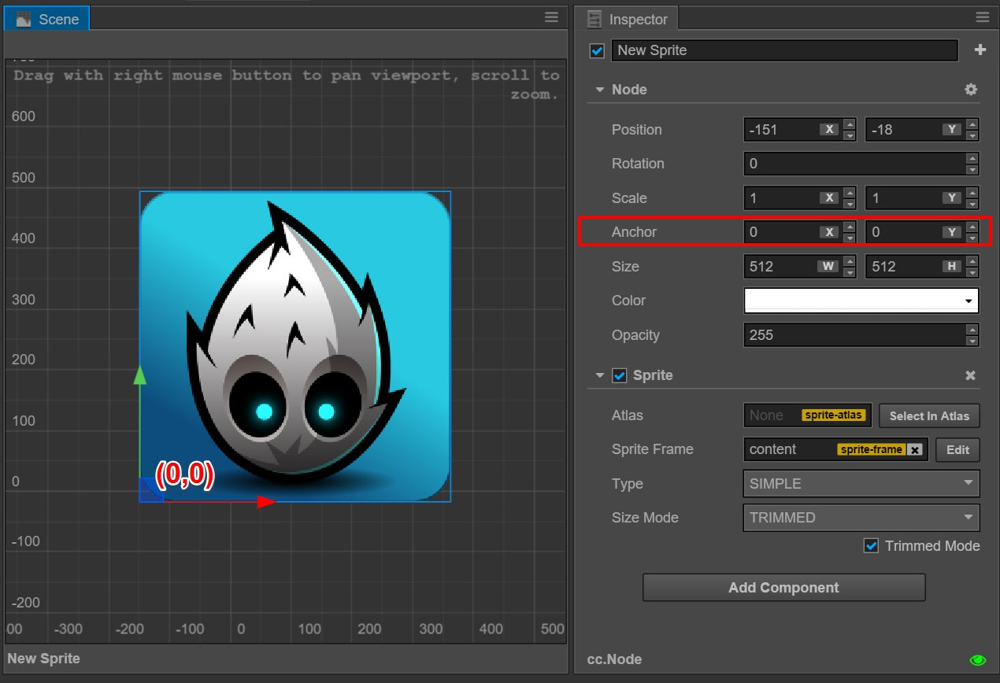
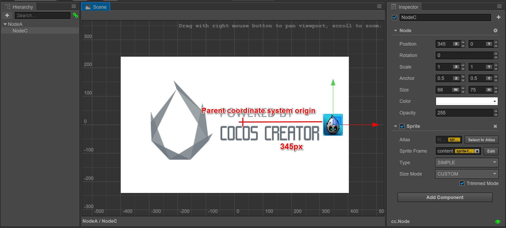
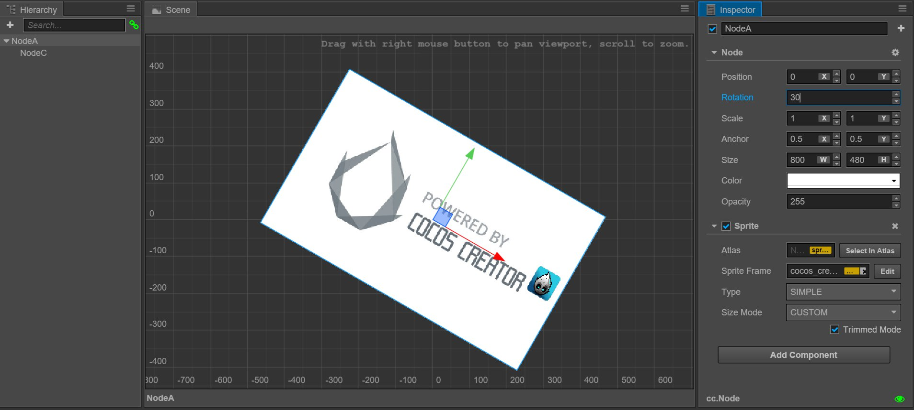
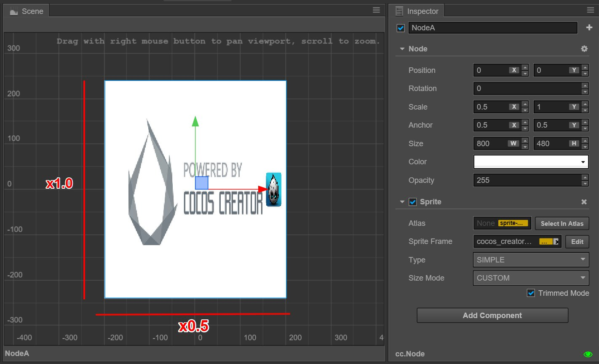

# Coordinate system and node transformation attribute

In the [Scene editor](../getting-started/basics/editor-panels/scene.md) and [Node and component](node-component.md) files, we introduced that we can change a node's display behaviour by using **change tools** and editing the node's attributes in the **Properties** panel. We will learn more about the coordinate system of where the node is and the operating principles of the node's four transformation attributes of Position, Rotation, Scale and Size in this section.

## Cocos Creator coordinates system

We have learnt that we can set the position attribute for a node, so where will a node with a specific position attribute be displayed on the screen when the game is operating? Like a map in real life, we can run satellite positioning using both longitude and latitude. We also need to learn about the coordinate system of Cocos Creator to understand the meaning of node positioning.

### Cartesian coordinate system

The Cocos Creator coordinate system is exactly the same as the cocos2d-x engine coordinate system. The cocos2d-x and OpenGL coordinate systems both originated from the Cartesian coordinate system. In the Cartesian coordinate system, the origin of the right-handed system is in the lower left corner with the direction of x going towards the right, y going upwards and z going outwards. This coordinate system we use is called the Cartesian right-handed coordinate system.

### Screen coordinate system and cocos2d-x coordinate system

The standard screen coordinate system uses a different coordinate system from OpenGL. It is very different from the cocos2d-x coordinate system.

The coordinate system used in developing applications with native SDK in iOS, Android, Windows Phone and other platforms is the standard screen coordinate system. The origin is located at the screen upper left corner with x going towards the right and y going downwards.

The cocos2d-x coordinate system is the same with the OpenGL coordinate system, the origin is in the lower left corner while x goes towards the right and y upwards.

### World Coordinates and Local Coordinates

The world coordinate system is also called the absolute coordinate system. It is a united coordinate system for displaying the scene space during Cocos Creator game development.「World」is used to indicate the scene in our game.

The local coordinate system is also called the relative coordinate system and it is related to the node. Each node has its own unique coordinates, so when the node is moving or changing directions, the coordinates related to this node will also move or change directions.

**Nodes** in Cocos Creator can have a hierarchical structure of set membership. The node position we altered in the node's **Position** attribute setting are the **local coordinates** relative to the parent node not the world coordinates. Finally, when drawing the entire scene Cocos Creator will map these nodes' local coordinates to the world coordinates.

To determine the function mode of the coordinate system for each node, we also need to understand the concept of **anchor**.

### Anchor

**Anchor** is another important property of nodes. It determines which point in the constraint frame of the node itself should be taken as the position of the whole node. The position we see the transformation tool show after we choose the node is the anchor position of the node.

Anchor is expressed by `anchorX` and `anchorY` which are multiplication factors in the range of `0 ~ 1`. They calculate the anchor position by using the node size. `(0.5, 0.5)` indicates the anchor is located in the position where the node length and width are both multiplied by 0.5, i.e. the center of the node.

When the anchor attribute is set as `(0, 0)`, the anchor is located at the origin of the node's local coordinates, i.e. the left bottom corner of the node constraint frame.

### The local coordinates of the child node

Once the anchor position is decided, all the child nodes will take the **anchor position** as the coordinate origin. One thing we need to note is this action is not the same as the default action in the cocos2d-x engine; it is a feature of the Cocos Creator coordinate system!

Hypothetically, the node structure in the scene is as follows:

When our scene contains nodes from different hierarchies, we should take the following steps when we determine the position of each node in the world coordinate system:

1. Process each node from the root level of the scene. `NodeA` in the above image is a root level node. First, determine the display position and coordinate origin position (same as the anchor position) according to the **Position** and **Anchor** attributes of NodeA.
2. Then process all of the direct child nodes of NodeA, i.e. `NodeB` and its sibling nodes. In NodeA's local coordinate system determine the position of NodeB in the scene space and the position of the origin of the coordinate system.
3. No matter how many levels that the nodes have, we process them all in order from highest level to the lowest. Each node should use the coordinates of the parent node and its own position anchor attribute to determine position within the scene space.

## Transform properties

Besides the **Anchor** we introduced above, the node also includes four other main transformation properties which we will introduce next.

### Position

**Position** is composed of `x` and `y` properties which set the node coordinates on the x and y axes of the current coordinates.

`NodeA` in the above image is at the root level of the scene. Its position is `(507, 354)` (refer to the scale on the background of the**scene editor**), the position of its child node `NodeC` is `(345, 0)`. You can see that the position of the child node migrated based on the parent node's anchor.

The default value of the position property is `(0, 0)` which means that the newly added node will always show up at the parent node's coordinate origin position. The default position of nodes in Cocos Creator is `(0, 0)` and the default anchor is set as `(0.5, 0.5)`. Nodes under this setting will be located at the center position of the parent node by default so that all the contents can be taken in when making UI or combining a player's character.

In the scene editor, you can always use [move transform tools](../getting-started/basics/editor-panels/scene.md#--9) to change a node`s position.

### Rotation

**Rotation** is another important property that will have an effect on a node`s local coordinates. The rotate property only has one value to indicate the current rotation angle of the node. When the angle value is positive, the node rotates clockwise; when the angle value is negative, the node rotates counter clockwise.

The node hierarchical relationship in the image above is the same as in the previous image only with the **Rotation** attribute of `Node` set as `30` degrees. As well as `NodeA` itself rotating 30 degrees clockwise, its child node `NodeC` also rotates 30 degrees clockwise taking the anchor of `NodeA` as the center.

In the scene editor, you can always use [rotate transform tools](../getting-started/basics/editor-panels/scene.md#--10) to change the rotation of a node.

### Scale

The **Scale** property is a set of multiplication factors which are composed of `scaleX` and `scaleY` to represent the scale percentage  of a node on the x and y axes.

The scale property of `NodeA` in the above image is set as `(0.5, 1.0)`. This means the node is reduced by factor of 0.5 on the x axis and remains the same on the y axis. You can see the image of its child node `NodeC` is also reduced on the x axis, so the scale property will influence all the child nodes.

The scale property set on the child node will have additive effects on the parent node. The child node of a child node will multiply all the scale properties on each hierarchy to get the scale percentage used in the world coordinate system. This is the same case with the position and rotation properties, it`s just that that position and rotation properties have additive effects, while the scale property makes the effects more obvious by multiplication.

The scale property acts on the effects of the properties of position and size among others. When you change the scale property, the node's position and size won't change, but it will multiply the position, size and other properties by a scale before showing the node image; the values from the multiplication are the actual position and size of the node that will appear.

In the scene editor, you can always use [scale transform tools](../getting-started/basics/editor-panels/scene.md#--11) to change the scale of the node.

### Size

The **Size** property is composed of `Width` and `Height` to stipulate the constraint frame's size. For the Sprite node, the size of the constraint frame is the size of the image that will appear.

Therefore, the size property can easily be confused with the scale property. They both can influence the size of the Sprite image, but they influence it in different ways. The size property, along with position and anchor, regulates the four endpoint positions of the node and determines the image display range of the constraints of these four points according to its result. The size property plays a vital role in rendering the [Sliced Sprite](../ui/sliced-sprite.md).

Meanwhile, the scale property gets the node's width and height after scaling based on the multiplication of the size value. When determining the size of the image, size is the basis while scale is the variable so to speak. Besides, the size property will not influence the size of the child node (but can make an indirect influence through [Widget](../ui/widget-align.md)), which is very different from the scale property.

In the scene editor, you can always use [rectangle transform tools](../getting-started/basics/editor-panels/scene.md#--11) to change the node size.